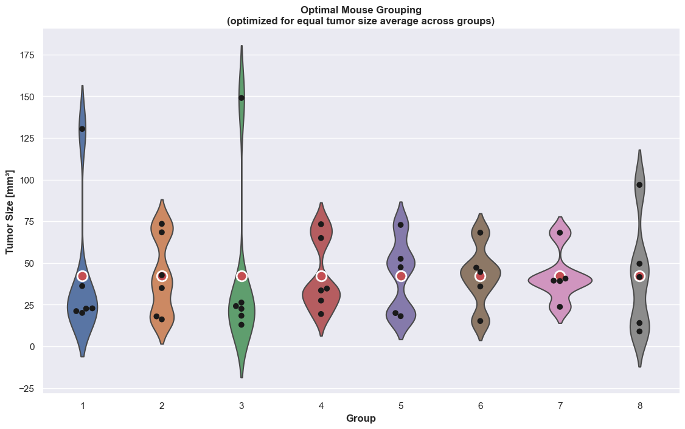

# Optimal Mouse Grouping

Optimal Mouse Grouping is a small program that can compute an optimal grouping of lab mice for laboratory experiments. :mouse::microscope: 

The lab mice are grouped according to a numerical property, in this case *tumor size*, where each mouse has a tumor of a certain size. The mice are then sought grouped so that the average tumor size in each group deviate as little as possible from each other.

The optimization is done using mathematical optimization, see the [Optimization details](#optimization-details) section below. :books:

The input to the program consists of an ID and a measured tumor size for each mouse as well as the minimum number of mice per group, see the [example](#running-the-program) below. The software will make as many groups of this size as possible, but to use all the mice, some groups might have an extra mouse or two added.

For example, if there are 44 mice and the minimum group size is 5, eight groups of 5 can be created. The remaining four mice are distributed onto the groups, resulting in four groups of 6 mice and four groups of 5 mice.


## Supported platforms

The program was developed and tested using Python 3.8 on Mac and Linux, specifically macOS Catalina 10.15.7 and Ubuntu 20.04. :computer: 


## Installation

First clone the project using [git](https://git-scm.com) and go into the project directory:
```bash
git clone https://github.com/johandicap/optimal-mouse-grouping
cd optimal-mouse-grouping
```
Then install the required Python packages and run the program as described below.

#### Install the requirements

These steps installs the python package requirements in a [conda](https://docs.conda.io/en/latest/miniconda.html) environment, but [pip](https://pip.pypa.io/en/stable/) can also be used.

Create a new conda environment with all the required packages as specified in the `conda-env.yml` file:

```bash
conda env create --file conda-env.yml --name py38omg
```
Note that the [mip](https://pypi.org/project/mip/) package will be installed inside the conda environment using pip (since the package is not currently available via conda).

Activate the new conda environment in order to use it:

```bash
conda activate py38omg
```
Note that your terminal will start showing `(py38omg)` to indicate that the conda environment is active.

To deactivate the conda environment, simply do:

```bash
conda deactivate
```


## Running the program

Use `--help` to see the program's command-line arguments: 
```bash
python3 mouse_grouping.py --help
```
Run the program on the provided example input data:
```bash
python3 mouse_grouping.py --input-file "./input/example_input.xlsx" --min-group-size 5 --max-seconds 30 --output-folder "./output" --save-model
```

#### What does it do

When executed, the program essentially performs the following steps:

1. Loads and verifies the input data, i.e. the list of mice with ID and tumor size, from an Excel spreadsheet.
2. Computes the group sizes based on the provided minimum group size.
3. Constructs the optimization problem based on the group sizes and mouse tumor sizes.
4. Runs the optimization for a specified number of seconds, e.g. 30 seconds.
5. Generates an output file (Excel spreadsheet) containing both a "mouse_grouping" sheet and a "group_statistics" sheet.
6. Generates an output plot (PNG image) of the grouping.


#### Required input

The main input is an Excel spreadsheet with a single sheet of mouse information:

- The sheet should contain a table with columns called "Mouse ID" and "Tumor size".
- The "Mouse ID" column should contain a unique ID for each mouse, e.g. a number from 1 to N.
- The "Tumor size" column should contain the measured tumor size for each mouse (in mm&sup3; as a decimal number).

An example of an input Excel spreadsheet can be found in `input/example_input.xlsx`.


#### Generated output

The following output files are saved to the specified output folder:

- `mouse_grouping.xlsx` - An Excel spreadsheet describing the optimized mouse grouping.
- `mouse_grouping.png` - A plot of the tumor sizes across mouse groups.

If `--save-model` is specified, it also saves the following:
- `mouse_grouping.lp` - A file containing the generated optimization model in [LP format](http://lpsolve.sourceforge.net/5.1/lp-format.htm).


Plot of results from running the optimization for 5 minutes (300 seconds) on the example input data:




## Optimization details

The described mouse grouping problem of minimizing the deviation between tumor size averages across groups can be formulated as a Mixed-Integer Linear Program (MIP). :chart_with_upwards_trend:

To solve this mathematical optimization problem, the program uses a Python package called `mip`, the [Python MIP (Mixed-Integer Linear Programming) Tools](https://pypi.org/project/mip/ "Python MIP (Mixed-Integer Linear Programming) Tools"), which includes the open-source COIN-OR Branch-&-Cut solver [CBC](https://projects.coin-or.org/Cbc) to solve MIPs.

It is pretty fast at coming up with a good and useful solution, although it does not necessarily reach optimality. :checkered_flag:

In the given example data with 44 mice, the optimizer makes good, continuous progress within the first two minutes, then it slows down, and after six minutes, it does not seem to find a better solution when running for additional ten minutes. :clock9:

But it is recommended to give it at least a couple of minutes to run when generating the final mouse grouping for the lab experiment, possibly more if you can spare it! :smiley:


## Acknowledgements

This program was created for my good friend and fellow scientist, Agnès García Lopez! :woman_scientist::microscope: 

